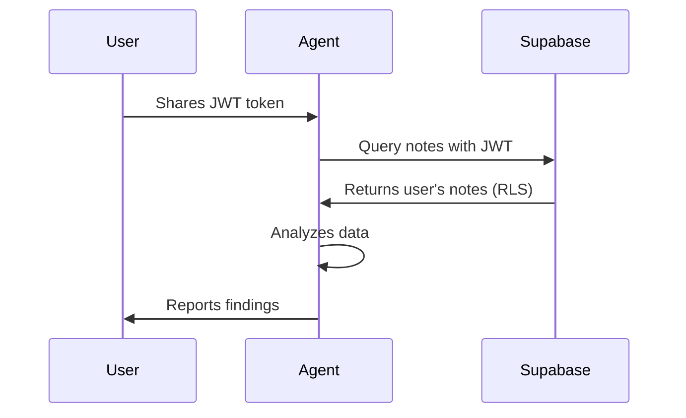
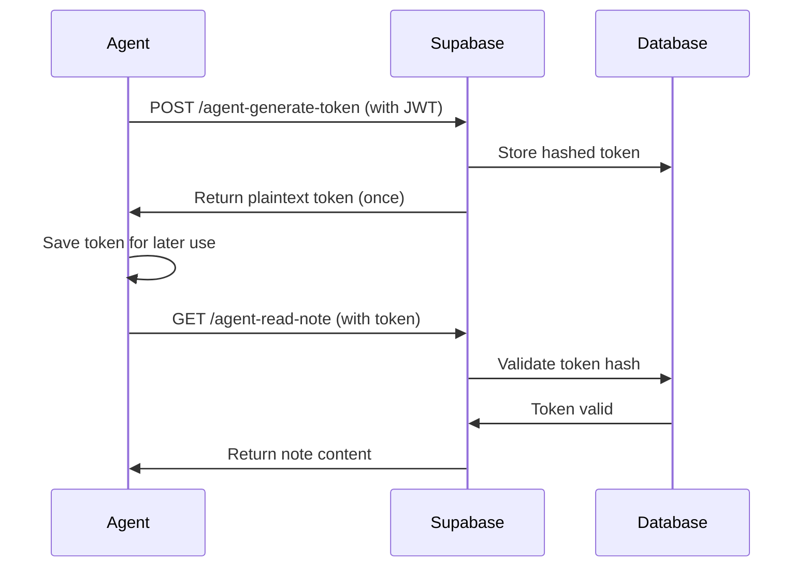

# Agent Engagement Guide

**Last Updated:** 2025-10-10
**Status:** Active and Deployed
**Version:** 1.0

---

## What Is This?

This document describes the **Agent Communication System** - a secure, persistent way for AI agents (like Claude Code) to interact with your Noted app database and codebase. Think of it as giving AI assistants API access to your data, with proper authentication and rate limiting.

### Key Concept

Instead of AI agents only being able to read/write files in your codebase, they can now:
- **Read** your notes from the database
- **Write/Update** notes programmatically
- **Analyze** your data across sessions
- **Implement features** that require database access
- **Test** with real production data

This bridges the gap between code changes and data manipulation, enabling agents to build features end-to-end.

---

## Architecture Overview

```
┌─────────────────────────────────────────────────────────┐
│                    User (You)                            │
│  - Shares JWT token with agent                          │
│  - Approves agent actions                               │
└──────────────────────┬──────────────────────────────────┘
                       │
                       ↓
┌─────────────────────────────────────────────────────────┐
│              Claude Code Agent                           │
│  - Reads your JWT from session                          │
│  - Generates agent tokens via API                       │
│  - Uses agent tokens to read/write notes               │
│  - Commits code changes to git                          │
└──────────────────────┬──────────────────────────────────┘
                       │
                       ↓
┌─────────────────────────────────────────────────────────┐
│         Supabase Edge Functions                          │
│                                                          │
│  ┌──────────────────────────────────────────┐           │
│  │  agent-generate-token                    │           │
│  │  - Creates persistent agent tokens       │           │
│  │  - Requires: User JWT                    │           │
│  │  - Returns: 64-char token (once)         │           │
│  └──────────────────────────────────────────┘           │
│                                                          │
│  ┌──────────────────────────────────────────┐           │
│  │  agent-read-note                         │           │
│  │  - Reads note content                    │           │
│  │  - Requires: Agent token                 │           │
│  │  - Rate limit: 100 req/hour              │           │
│  └──────────────────────────────────────────┘           │
│                                                          │
│  ┌──────────────────────────────────────────┐           │
│  │  agent-update-note                       │           │
│  │  - Updates/appends to notes              │           │
│  │  - Requires: Agent token                 │           │
│  │  - Supports optimistic locking           │           │
│  └──────────────────────────────────────────┘           │
│                                                          │
│  ┌──────────────────────────────────────────┐           │
│  │  agent-revoke-token                      │           │
│  │  - Revokes agent tokens                  │           │
│  │  - Requires: User JWT                    │           │
│  └──────────────────────────────────────────┘           │
└──────────────────────┬──────────────────────────────────┘
                       │
                       ↓
┌─────────────────────────────────────────────────────────┐
│            Supabase PostgreSQL Database                  │
│                                                          │
│  ┌──────────────┐  ┌──────────────┐  ┌──────────────┐ │
│  │    notes     │  │ agent_tokens │  │agent_write   │ │
│  │              │  │              │  │     _log     │ │
│  │ - id         │  │ - id         │  │              │ │
│  │ - user_id    │  │ - user_id    │  │ - token_id   │ │
│  │ - title      │  │ - token_hash │  │ - note_id    │ │
│  │ - content    │  │ - expires_at │  │ - timestamp  │ │
│  │ - created_at │  │ - revoked_at │  │ - content_   │ │
│  │ - updated_at │  │ - requests_  │  │   hash       │ │
│  └──────────────┘  │   count      │  └──────────────┘ │
│                    │ - rate_limit │                    │
│                    │   _reset_at  │                    │
│                    └──────────────┘                    │
└─────────────────────────────────────────────────────────┘
```

---

## Capabilities

### What Agents Can Do

#### 1. Database Operations
✅ **Read Notes**
- Query any of your notes by ID
- Filter by title, date, tags
- Full content access
- Metadata (created_at, updated_at)

✅ **Write/Update Notes**
- **Replace mode:** Overwrite entire note content
- **Append mode:** Add to existing content
- **Optimistic locking:** Prevent race conditions
- **Content validation:** XSS prevention, size limits (10 KiB)

✅ **Batch Operations** (with Service Role Key)
- Generate AI summaries for all notes
- Auto-generate titles
- Bulk formatting/cleanup
- Data migrations

#### 2. Code Operations
✅ **File Manipulation**
- Read/write any file in the codebase
- Create new components/services
- Modify existing code

✅ **Git Operations**
- Commit changes
- Push to remote
- Create branches
- View git history

✅ **Deployment**
- Deploy Edge Functions to Supabase
- Update environment variables
- Run build commands

#### 3. AI Features
✅ **Integration** (see `CLAUDE.md`)
- Generate AI summaries
- Auto-generate titles
- Smart categorization
- Content enhancement
- Web research integration

✅ **Testing**
- Run test suites
- Validate data
- Performance analysis

### What Agents Cannot Do

❌ **Security Restrictions**
- Cannot access other users' data (with user JWT)
- Cannot bypass rate limits (100 req/hour per token)
- Cannot modify revoked tokens
- Cannot access expired tokens

❌ **Database Constraints**
- Cannot write content >10 KiB
- Cannot inject XSS/malicious content
- Cannot modify RLS policies (without service role)
- Cannot bypass optimistic locking

---

## Authentication Flow

### Session-Based Access (User JWT)



**Characteristics:**
- JWT expires after a few hours/days
- Access limited to your data only (RLS)
- Must be renewed for each new agent session
- Obtained from browser DevTools → Local Storage

### Token-Based Access (Agent Tokens)



**Characteristics:**
- Tokens persist for 90 days
- Work across all sessions and agents
- Stored securely in database (bcrypt hashed)
- Can be revoked anytime
- Rate limited (100 requests/hour)

---

## How to Engage an Agent

### Step 1: Start a Session

**For agents:** First, read the `.env` file to get the Supabase anon key (`EXPO_PUBLIC_SUPABASE_ANON_KEY`). You'll need this for all database queries.

Example:
```bash
# Agent reads .env file
Read tool: .env
# Extract: EXPO_PUBLIC_SUPABASE_ANON_KEY=eyJhbGci...
```

Open Claude Code terminal and provide context:

```bash
# Option A: Provide JWT token from browser
# (DevTools → Application → Local Storage → sb-*-auth-token)

{
  "access_token": "eyJhbGci...",
  "user_id": "your-user-id"
}
```

### Step 2: Agent Generates Token (Optional)

If needed for persistent access:

```bash
# Agent runs:
curl -X POST "https://ikovzegiuzjkubymwvjz.supabase.co/functions/v1/agent-generate-token" \
  -H "Authorization: Bearer YOUR_JWT" \
  -d '{"name": "Session 2025-10-10"}'

# Returns:
{
  "token": "agent_xxx...",  # Save this!
  "token_id": "uuid",
  "expires_at": "2026-01-08T...",
  "warning": "Save this token securely. It will not be shown again."
}
```

### Step 3: Agent Works

The agent can now:
- Query your notes
- Implement features
- Test with real data
- Generate AI content
- Commit changes to git

### Step 4: Review and Approve

Agent presents work:
- Code changes (git diff)
- Database modifications
- Test results
- Deployment plan

You approve, and agent executes.

---

## Session Persistence

### Problem: Context Loss Between Sessions

Traditional AI interactions lose context when the session ends. Agent memory is wiped.

### Solution: Persistent Artifacts

| Artifact | Where It Lives | Persistence |
|----------|----------------|-------------|
| **Code changes** | Git repository | Permanent |
| **Database changes** | Supabase PostgreSQL | Permanent |
| **Agent tokens** | `agent_tokens` table | 90 days |
| **Session notes** | Your notes app | Permanent |
| **Edge Functions** | Supabase deployment | Permanent |
| **Configuration** | `supabase/config.toml` | Permanent |

### How Future Agents Resume Work

1. **Read this document** (`AGENT-ENGAGEMENT.md`)
2. **Check git history** for recent changes
3. **Query database** to see current state
4. **Ask user** for fresh JWT token
5. **Continue** from where previous agent left off

---

## Token Management

### Active Tokens (Your Account)

Check your active tokens:

**For agents:** Read the anon key from `.env` file (`EXPO_PUBLIC_SUPABASE_ANON_KEY`)

```bash
curl "https://ikovzegiuzjkubymwvjz.supabase.co/rest/v1/agent_tokens?select=*&order=created_at.desc" \
  -H "apikey: <read from .env EXPO_PUBLIC_SUPABASE_ANON_KEY>" \
  -H "Authorization: Bearer YOUR_JWT"
```

### Revoke a Token

```bash
curl -X POST "https://ikovzegiuzjkubymwvjz.supabase.co/functions/v1/agent-revoke-token" \
  -H "Authorization: Bearer YOUR_JWT" \
  -d '{"token_id": "uuid-to-revoke"}'
```

### Token Security

✅ **What's Secure:**
- Tokens stored as bcrypt hashes (not plaintext)
- Rate limited (100 req/hour)
- Auto-revoked after 10 failed attempts
- Expire after 90 days
- Can be manually revoked anytime

⚠️ **What You Should Do:**
- Never commit tokens to git
- Store tokens in secure password manager
- Revoke tokens when no longer needed
- Monitor usage via `agent_write_log` table

---

## Examples

### Example 1: Generate AI Summaries

**User Request:**
> "Generate AI summaries for all my notes that don't have one yet"

**Agent Workflow:**
1. Query notes without `ai_summary`:
   ```sql
   SELECT id, content FROM notes WHERE ai_summary IS NULL
   ```
2. For each note:
   - Call Claude API to generate summary
   - Update note: `UPDATE notes SET ai_summary = ... WHERE id = ...`
3. Report completion

### Example 2: Format All Notes

**User Request:**
> "Clean up markdown formatting in all my notes"

**Agent Workflow:**
1. Query all notes
2. For each note:
   - Parse markdown
   - Fix common issues (double spaces, missing newlines)
   - Update note content
3. Log changes
4. Commit to git if code changes involved

### Example 3: Test New Feature

**User Request:**
> "Test the new publish feature with my real notes"

**Agent Workflow:**
1. Read test notes from database
2. Call publish endpoint
3. Verify published URLs work
4. Check rate limiting
5. Report results

---

## Configuration Files

### supabase/config.toml

```toml
# Agent endpoints use custom token auth
[functions.agent-read-note]
verify_jwt = false

[functions.agent-update-note]
verify_jwt = false

# User endpoints require JWT
[functions.agent-generate-token]
# verify_jwt = true (default)

[functions.agent-revoke-token]
# verify_jwt = true (default)
```

### Environment Variables

**For agents:** All these values are stored in the `.env` file at the project root. Read this file to get the anon key.

```bash
# Supabase (in .env file)
EXPO_PUBLIC_SUPABASE_URL=https://ikovzegiuzjkubymwvjz.supabase.co
EXPO_PUBLIC_SUPABASE_ANON_KEY=<64-char JWT token - read from .env>

# Deno Edge Functions (in Supabase dashboard - not needed for basic operations)
SUPABASE_URL=https://ikovzegiuzjkubymwvjz.supabase.co
SUPABASE_SERVICE_ROLE_KEY=<service role key - only needed for batch operations>
```

---

## Testing

### Run Full Test Suite

```bash
# Set environment variables
export USER_JWT="your-jwt-token"
export NOTE_ID="a-test-note-id"

# Run tests
deno run --allow-net --allow-env test-agent-endpoints.ts
```

### Expected Results

```
Total Tests: 9
✅ Passed: 9
❌ Failed: 0
Success Rate: 100.0%
```

---

## Troubleshooting

### "Invalid JWT" Error

**Cause:** JWT token expired or malformed
**Fix:** Get fresh token from browser DevTools

### "Rate limit exceeded"

**Cause:** Exceeded 100 requests/hour
**Fix:** Wait for rate limit reset or generate new token

### "Token not found"

**Cause:** Token was revoked or never existed
**Fix:** Generate new token with `agent-generate-token`

### "Row-level security policy"

**Cause:** Trying to access data you don't own
**Fix:** Verify user_id matches JWT token

---

## Future Enhancements

### Planned Features

- [ ] Multi-user token management UI
- [ ] Token usage analytics dashboard
- [ ] Automated token rotation
- [ ] Webhook support for agent callbacks
- [ ] GraphQL endpoint for complex queries
- [ ] Real-time subscriptions for agents

### AI Integration (see `CLAUDE.md`)

- [ ] Phase 1: Smart Titles & Summaries
- [ ] Phase 2: Web Research & Categorization
- [ ] Phase 3: Content Enhancement & Chat

---

## Getting Help

### For Future Agents

1. **Read this document first**
2. **Read `.env` file** to get the Supabase anon key (`EXPO_PUBLIC_SUPABASE_ANON_KEY`)
3. **Check git history:** `git log --oneline -20`
4. **Query database state:** Use provided curl examples (with anon key from .env)
5. **Ask user for:**
   - Current JWT token
   - Service role key (if needed for batch operations)
   - Specific goals for the session

### For Users

1. **Share JWT token:** Get from DevTools → Local Storage
2. **Review agent proposals:** Always check before approving
3. **Monitor usage:** Check `agent_write_log` table
4. **Revoke tokens:** Use settings UI or curl command

---

## Summary

**Agent Engagement** is a secure, persistent way for AI assistants to work with your Noted app at the database level. It enables:

✅ Multi-session workflows
✅ Data-driven feature development
✅ AI-powered batch operations
✅ Real-world testing with production data
✅ Continuous collaboration across agent instances

All while maintaining security through:
- Token-based authentication
- Rate limiting
- Audit logging
- User approval gates

**This is the foundation for advanced AI features in Noted.**

---

*Last session: 2025-10-10*
*Git commits: `cf149ee`, `b278f41`*
*Test suite: 100% passing (9/9)*
